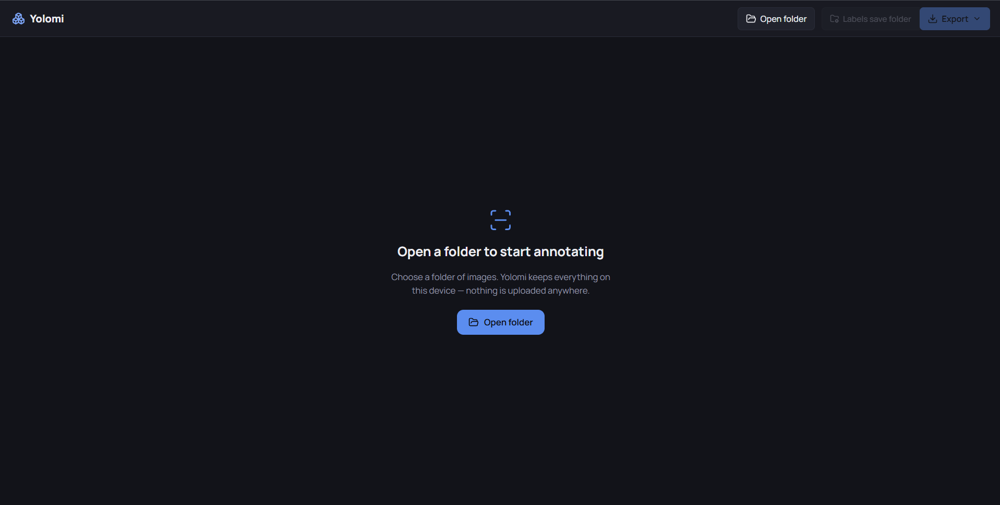
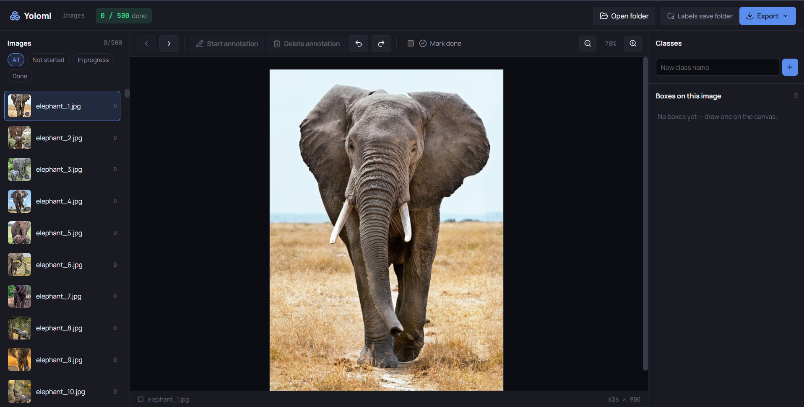
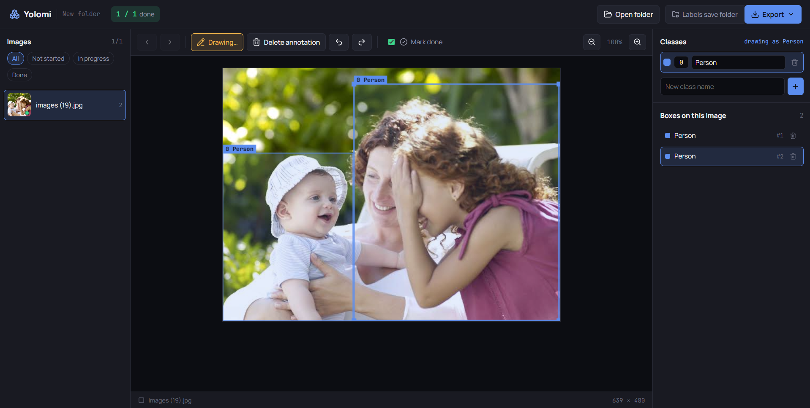

<div align="center">


# Yolomi

**A browser-based bounding box annotation tool for computer vision datasets**

Draw boxes, assign classes, export YOLO / COCO / Pascal VOC — no install, no backend, no account. Everything stays on your machine.

[](https://react.dev/)
[](https://vitejs.dev/)
[](#how-it-works)
[](LICENSE)

</div>

---

## Run

```cmd
cd yolomi
npm install
npm run dev
```

Open the printed `http://localhost:5173` in **Chrome or Edge** (needed for real folder read/write via the File System Access API — other browsers fall back to read-only picking and zip downloads). Click **Open folder**, point it at a directory of images, and start annotating.

## How it works

Yolomi is a single-page app with **no backend and no database** — it runs entirely in your browser. Images never leave your machine; there's nothing to upload, no server to run, nothing to configure. Project state lives in memory while the tab is open, and label files are written straight back to a folder you choose using the File System Access API.

## Yolomi UI



## Image list and progress tracking



## Annotation in progress



## Features

- **Draw, select, move, resize** bounding boxes directly on the canvas, with corner-handle resizing and a lightweight two-layer canvas (image drawn once, boxes redrawn separately) so dragging stays smooth even on large images.
- **Overlapping boxes supported** — while in annotation mode, a click always starts a new box, even on top of an existing one, so densely packed objects can each get their own box (see the two overlapping "Person" boxes above).
- **Per-class colors**, auto-assigned and stable across sessions, with a colored label tag on every box so classes stay visually distinguishable at a glance.
- **Custom class IDs** — each class's numeric ID is user-editable rather than auto-incremented, with duplicate and gap warnings, since that ID is what gets written into YOLO/COCO exports.
- **Left-hand image panel** with thumbnails, a completion badge per image (not started / in progress / done), a status filter, and a running `done / total` counter.
- **Start annotation / Delete annotation** controls, plus per-image "Mark done," so progress is explicit rather than inferred.
- **Guardrail on drawing without a label** — trying to draw before selecting (or creating) a class shows a clear message instead of silently doing nothing.
- **Natural, numeric image ordering** — files like `img2.jpg`, `img10.jpg` are sorted in true numeric order rather than ASCII order, matching how File Explorer normally lists a folder.
- **Undo / redo** per image, plus zoom controls and keyboard delete.
- **Context-aware cursor** — grab/grabbing over movable boxes, matching resize cursors over corner handles, crosshair while actively drawing.
- **Labels save folder** — choose exactly where label files are written; exports go straight into that folder as real files, not a zip, as long as the browser grants write access. Zip download is only a last-resort fallback for browsers without File System Access support.
- **Export formats**:
  - **YOLO** — one `.txt` per image (normalized box coordinates) plus `classes.txt` indexed by class ID.
  - **COCO** — a single `instances.json` with images, categories, and annotations.
  - **Pascal VOC** — one `.xml` per image, following the standard VOC schema.

## Project structure

```
yolomi/
├── index.html
├── package.json
├── vite.config.js
├── public/                    # favicon, static assets
├── docs/
│   └── screenshots/            # README images
└── src/
    ├── main.jsx                # React entry point
    ├── App.jsx                 # Layout + open/export wiring
    ├── store/
    │   └── useProjectStore.js  # All app state: images, classes, boxes, undo/redo, mode
    ├── lib/
    │   ├── colors.js            # Class color palette
    │   ├── fileSystem.js        # Folder open/save, File System Access + zip fallback
    │   └── exporters/
    │       ├── yolo.js
    │       ├── coco.js
    │       └── pascalVoc.js
    └── components/              # TopBar, Sidebar, Canvas, ClassPanel, BoxList, EmptyState
```

## Data model

Each image record holds its boxes in **absolute pixel coordinates** (top-left `x`, `y`, plus `w`, `h`) at the image's natural resolution — not normalized until export time, so no precision is lost while editing. Normalization to YOLO's `0–1` range, or reformatting into COCO/VOC's own coordinate conventions, happens only inside the relevant exporter.

## Development

```bash
npm install
npm run dev      # local dev server with hot reload
npm run build    # production build to dist/
npm run lint     # oxlint
```

## License

Licensed under a custom license — free to use, but modification and redistribution of modified versions are not permitted. See the [LICENSE](LICENSE) file for full terms.
